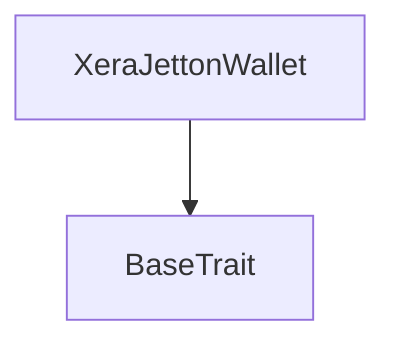
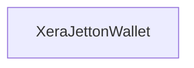

# Tact compilation report
Contract: XeraJettonWallet
BoC Size: 1016 bytes

## Structures (Structs and Messages)
Total structures: 34

### DataSize
TL-B: `_ cells:int257 bits:int257 refs:int257 = DataSize`
Signature: `DataSize{cells:int257,bits:int257,refs:int257}`

### SignedBundle
TL-B: `_ signature:fixed_bytes64 signedData:remainder<slice> = SignedBundle`
Signature: `SignedBundle{signature:fixed_bytes64,signedData:remainder<slice>}`

### StateInit
TL-B: `_ code:^cell data:^cell = StateInit`
Signature: `StateInit{code:^cell,data:^cell}`

### Context
TL-B: `_ bounceable:bool sender:address value:int257 raw:^slice = Context`
Signature: `Context{bounceable:bool,sender:address,value:int257,raw:^slice}`

### SendParameters
TL-B: `_ mode:int257 body:Maybe ^cell code:Maybe ^cell data:Maybe ^cell value:int257 to:address bounce:bool = SendParameters`
Signature: `SendParameters{mode:int257,body:Maybe ^cell,code:Maybe ^cell,data:Maybe ^cell,value:int257,to:address,bounce:bool}`

### MessageParameters
TL-B: `_ mode:int257 body:Maybe ^cell value:int257 to:address bounce:bool = MessageParameters`
Signature: `MessageParameters{mode:int257,body:Maybe ^cell,value:int257,to:address,bounce:bool}`

### DeployParameters
TL-B: `_ mode:int257 body:Maybe ^cell value:int257 bounce:bool init:StateInit{code:^cell,data:^cell} = DeployParameters`
Signature: `DeployParameters{mode:int257,body:Maybe ^cell,value:int257,bounce:bool,init:StateInit{code:^cell,data:^cell}}`

### StdAddress
TL-B: `_ workchain:int8 address:uint256 = StdAddress`
Signature: `StdAddress{workchain:int8,address:uint256}`

### VarAddress
TL-B: `_ workchain:int32 address:^slice = VarAddress`
Signature: `VarAddress{workchain:int32,address:^slice}`

### BasechainAddress
TL-B: `_ hash:Maybe int257 = BasechainAddress`
Signature: `BasechainAddress{hash:Maybe int257}`

### Deploy
TL-B: `deploy#946a98b6 queryId:uint64 = Deploy`
Signature: `Deploy{queryId:uint64}`

### DeployOk
TL-B: `deploy_ok#aff90f57 queryId:uint64 = DeployOk`
Signature: `DeployOk{queryId:uint64}`

### FactoryDeploy
TL-B: `factory_deploy#6d0ff13b queryId:uint64 cashback:address = FactoryDeploy`
Signature: `FactoryDeploy{queryId:uint64,cashback:address}`

### JettonTransferInternal
TL-B: `jetton_transfer_internal#178d4519 queryId:uint64 amount:coins sender:address responseDestination:address forwardTonAmount:coins forwardPayload:remainder<slice> = JettonTransferInternal`
Signature: `JettonTransferInternal{queryId:uint64,amount:coins,sender:address,responseDestination:address,forwardTonAmount:coins,forwardPayload:remainder<slice>}`

### JettonTransferNotification
TL-B: `jetton_transfer_notification#7362d09c queryId:uint64 amount:coins sender:address forwardPayload:remainder<slice> = JettonTransferNotification`
Signature: `JettonTransferNotification{queryId:uint64,amount:coins,sender:address,forwardPayload:remainder<slice>}`

### JettonTransfer
TL-B: `jetton_transfer#0f8a7ea5 queryId:uint64 amount:coins destination:address responseDestination:address customPayload:Maybe ^cell forwardTonAmount:coins forwardPayload:remainder<slice> = JettonTransfer`
Signature: `JettonTransfer{queryId:uint64,amount:coins,destination:address,responseDestination:address,customPayload:Maybe ^cell,forwardTonAmount:coins,forwardPayload:remainder<slice>}`

### JettonBurn
TL-B: `jetton_burn#595f07bc queryId:uint64 amount:coins responseDestination:address customPayload:Maybe ^cell = JettonBurn`
Signature: `JettonBurn{queryId:uint64,amount:coins,responseDestination:address,customPayload:Maybe ^cell}`

### JettonBurnNotification
TL-B: `jetton_burn_notification#7bdd97de queryId:uint64 amount:coins sender:address responseDestination:address = JettonBurnNotification`
Signature: `JettonBurnNotification{queryId:uint64,amount:coins,sender:address,responseDestination:address}`

### TokenExcesses
TL-B: `token_excesses#d53276db queryId:uint64 = TokenExcesses`
Signature: `TokenExcesses{queryId:uint64}`

### JettonTransferError
TL-B: `jetton_transfer_error#ffffffff queryId:uint64 = JettonTransferError`
Signature: `JettonTransferError{queryId:uint64}`

### JettonData
TL-B: `_ totalSupply:coins mintable:bool adminAddress:address jettonContent:^cell jettonWalletCode:^cell = JettonData`
Signature: `JettonData{totalSupply:coins,mintable:bool,adminAddress:address,jettonContent:^cell,jettonWalletCode:^cell}`

### WalletData
TL-B: `_ balance:coins owner:address minter:address jettonWalletCode:^cell = WalletData`
Signature: `WalletData{balance:coins,owner:address,minter:address,jettonWalletCode:^cell}`

### Mint
TL-B: `mint#00001000 queryId:uint64 receiver:address amount:coins = Mint`
Signature: `Mint{queryId:uint64,receiver:address,amount:coins}`

### ChangeAdmin
TL-B: `change_admin#00001001 newAdmin:address = ChangeAdmin`
Signature: `ChangeAdmin{newAdmin:address}`

### ClaimData
TL-B: `_ user:address amount:coins referenceId:uint256 deadline:uint64 = ClaimData`
Signature: `ClaimData{user:address,amount:coins,referenceId:uint256,deadline:uint64}`

### Claim
TL-B: `claim#00002000 queryId:uint64 data:^cell signature:remainder<slice> = Claim`
Signature: `Claim{queryId:uint64,data:^cell,signature:remainder<slice>}`

### RotateSigner
TL-B: `rotate_signer#00002001 newSigner:uint256 = RotateSigner`
Signature: `RotateSigner{newSigner:uint256}`

### SetPaused
TL-B: `set_paused#00002002 paused:bool = SetPaused`
Signature: `SetPaused{paused:bool}`

### SetDistributor
TL-B: `set_distributor#00002003 distributor:address = SetDistributor`
Signature: `SetDistributor{distributor:address}`

### Release
TL-B: `release#00003001 queryId:uint64 = Release`
Signature: `Release{queryId:uint64}`

### XeraJettonWallet$Data
TL-B: `_ balance:coins owner:address minter:address jettonWalletCode:^cell = XeraJettonWallet`
Signature: `XeraJettonWallet{balance:coins,owner:address,minter:address,jettonWalletCode:^cell}`

### Tranche
TL-B: `_ owner:address amount:coins released:coins start:uint64 duration:uint64 = Tranche`
Signature: `Tranche{owner:address,amount:coins,released:coins,start:uint64,duration:uint64}`

### ReleaseOne
TL-B: `release_one#07a2e712 referenceId:uint256 = ReleaseOne`
Signature: `ReleaseOne{referenceId:uint256}`

### XeraVesting$Data
TL-B: `_ minter:address jettonWalletCode:^cell distributor:address admin:address vestingDuration:uint64 paused:bool tranches:dict<int, ^Tranche{owner:address,amount:coins,released:coins,start:uint64,duration:uint64}> userLockedTotal:dict<address, int> = XeraVesting`
Signature: `XeraVesting{minter:address,jettonWalletCode:^cell,distributor:address,admin:address,vestingDuration:uint64,paused:bool,tranches:dict<int, ^Tranche{owner:address,amount:coins,released:coins,start:uint64,duration:uint64}>,userLockedTotal:dict<address, int>}`

## Get methods
Total get methods: 1

## get_wallet_data
No arguments

## Exit codes
* 2: Stack underflow
* 3: Stack overflow
* 4: Integer overflow
* 5: Integer out of expected range
* 6: Invalid opcode
* 7: Type check error
* 8: Cell overflow
* 9: Cell underflow
* 10: Dictionary error
* 11: 'Unknown' error
* 12: Fatal error
* 13: Out of gas error
* 14: Virtualization error
* 32: Action list is invalid
* 33: Action list is too long
* 34: Action is invalid or not supported
* 35: Invalid source address in outbound message
* 36: Invalid destination address in outbound message
* 37: Not enough Toncoin
* 38: Not enough extra currencies
* 39: Outbound message does not fit into a cell after rewriting
* 40: Cannot process a message
* 41: Library reference is null
* 42: Library change action error
* 43: Exceeded maximum number of cells in the library or the maximum depth of the Merkle tree
* 50: Account state size exceeded limits
* 128: Null reference exception
* 129: Invalid serialization prefix
* 130: Invalid incoming message
* 131: Constraints error
* 132: Access denied
* 133: Contract stopped
* 134: Invalid argument
* 135: Code of a contract was not found
* 136: Invalid standard address
* 138: Not a basechain address
* 7445: XeraVesting: deposits paused
* 11354: XeraVesting: notification not from our own jetton wallet
* 16591: XeraVesting: referenceId already deposited
* 17068: XeraJettonWallet: not owner
* 26240: XeraJettonWallet: insufficient balance
* 29707: XeraJettonWallet: unauthorized credit
* 34116: XeraVesting: nothing to release
* 42316: XeraVesting: credit not from the authorized distributor
* 58683: XeraVesting: not admin
* 63506: XeraVesting: unknown referenceId

## Trait inheritance diagram

## Contract dependency diagram

